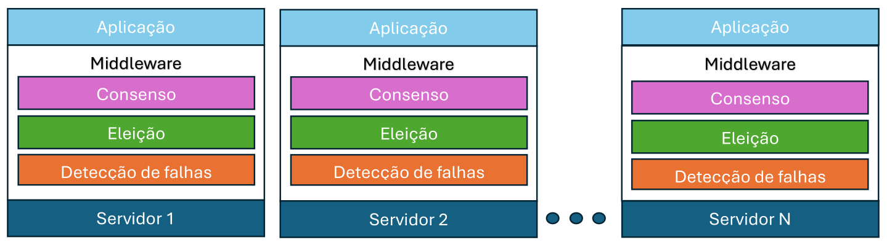

# Trabalho final da disciplina de SDI

Trabalho final da disciplina de SDI (Sistemas Distribuídos) com o objetivo de aplicar os conceitos sobre detecção de falhas, eleição de líderes e consenso entre processos. O seguinte cenário de execução é proposto:




## Instalação:

Para fazer a instalação do sistema primeiramente baixe o repositório do trabalho.

Crie uma máquina virtual Python dentro do repositório:

```sh
$ python3 -m venv .venv
```

Inicie a máquina virtual:

```sh
$ source .venv/bin/activate
```


Instale as dependências do projeto:

```sh
$ pip install -r requirements.txt
```

## Execução do trabalho:

Para executar um Servidor individual do sistema, execute o seguinte comando:

```sh
$ python3 main.py --id <ID>
````

Onde <ID> é o identificador único de cada Servidor, não podendo ter ID repetidos no sistema.
